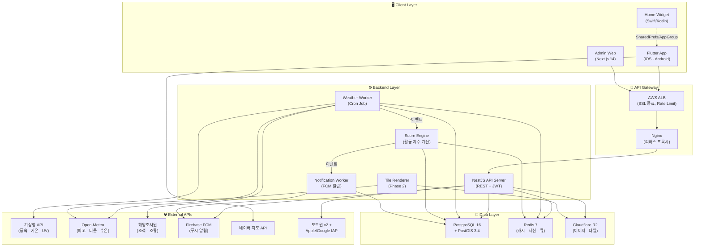
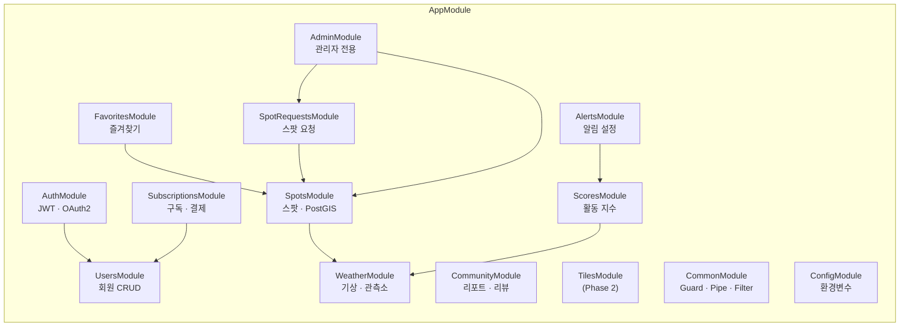
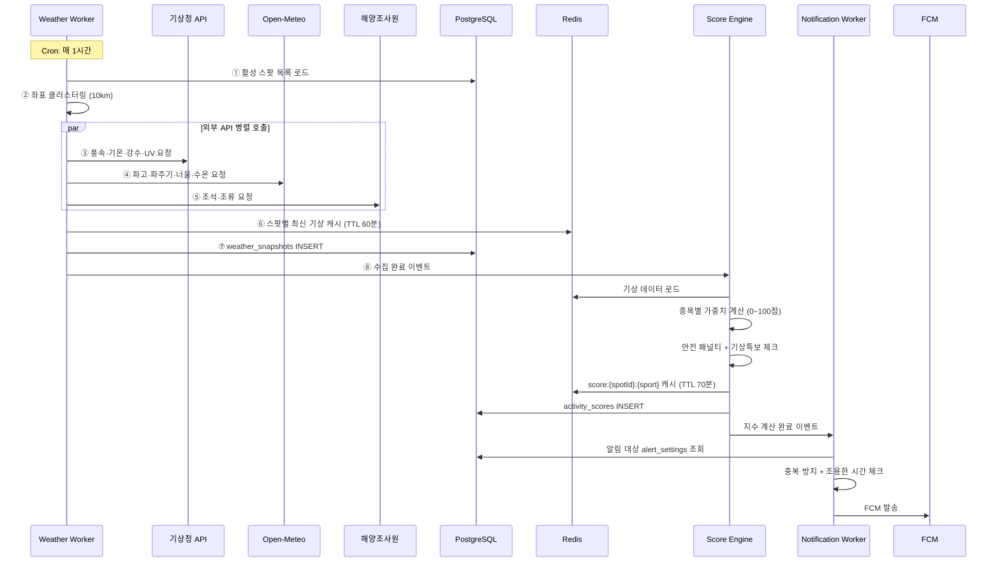
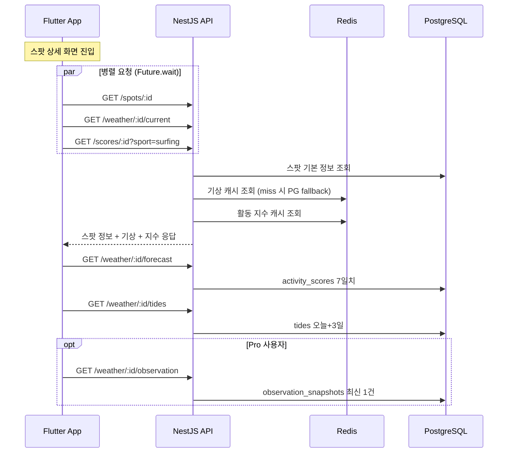
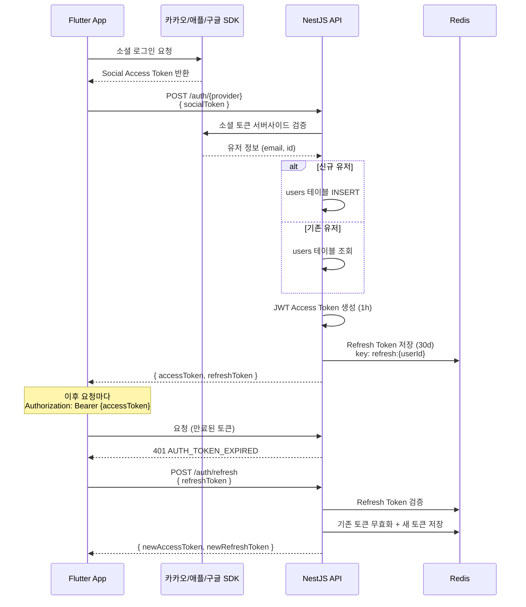
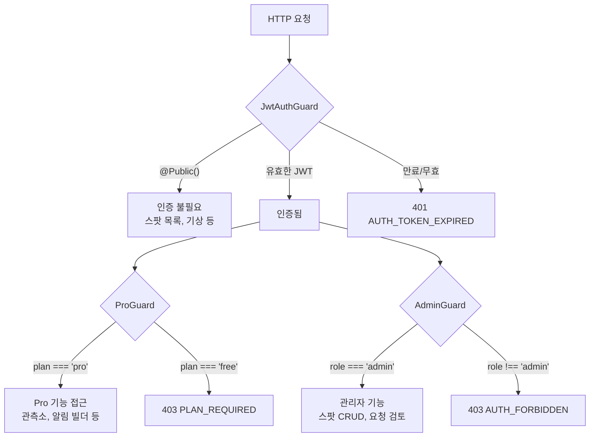

# 🌊 WAVESPOT 시스템 아키텍처 설계

> TDD v1.1 · SRS v1.3 기반 | 작성일: 2026-03-09

---

## 1. 전체 시스템 구성도

---

## 2. NestJS 모듈 구조

### 모듈별 담당 엔드포인트

| 모듈 | 엔드포인트 | 인증 |
|------|-----------|------|
| AuthModule | `POST /auth/kakao, /auth/apple, /auth/google, /auth/refresh` | 없음 |
| UsersModule | `GET/PATCH /users/me` | JWT |
| SpotsModule | `GET /spots, /spots/:id, /spots/near` | Public / Admin |
| WeatherModule | `GET /weather/:spotId/current, /forecast, /tides, /observation` | Public / Pro |
| ScoresModule | `GET /scores/:spotId, /scores/:spotId/timeline` | Public |
| AlertsModule | `GET/POST/DELETE /alerts` | JWT / Pro |
| FavoritesModule | `GET/POST/DELETE /favorites` | JWT |
| CommunityModule | `GET/POST /reports, /reviews` | Public / Pro |
| SpotRequestsModule | `POST /spot-requests` | Pro / Admin |
| SubscriptionsModule | `GET /subscriptions/me, POST /subscriptions/webhook` | JWT |
| AdminModule | 스팟 CRUD, 요청 승인/반려 | Admin |

---

## 3. 핵심 데이터 플로우

### 3.1 기상 데이터 수집 파이프라인

### 3.2 앱 → 서버 요청 플로우 (스팟 상세)

### 3.3 소셜 로그인 + JWT 인증 플로우

---

## 4. 캐싱 전략 (Redis)

| 키 패턴 | 데이터 | TTL | 용도 |
|---------|--------|-----|------|
| `weather:{spotId}` | 최신 기상 데이터 JSON | 60분 | 앱 현재 컨디션 API 응답 |
| `score:{spotId}:{sport}:{timestamp}` | 활동 지수 + 등급 | 70분 | 지수 API 응답 (다음 수집 전까지) |
| `refresh:{userId}` | Refresh Token (opaque) | 30일 | 인증 토큰 관리 |
| `alert_log:{spotId}:{grade}` | 발송 이력 | 24시간 | 알림 중복 방지 |
| `tile:latest` | 최신 타일 datetime | 1시간 | 앱 타일 레이어 polling |
| `rate:{ip}:{endpoint}` | 호출 카운트 | 1분 | Rate Limiting |

---

## 5. Guard 체계 (인증·인가)

---

## 6. 환경별 인프라 구성

| 환경 | 인프라 | DB | Redis |
|------|--------|-------|-------|
| **Development** | Docker Compose 로컬 | PostGIS 16 (Docker) | Redis 7 (Docker) |
| **Staging** | AWS ECS Fargate | RDS t3.micro | ElastiCache t3.micro |
| **Production** | AWS ECS Fargate (x2, Auto-scaling) | RDS t3.small+ | ElastiCache t3.small |

### Production 월 예상 비용: ~₩153,700

| 서비스 | 사양 | 비용 |
|--------|------|------|
| ECS Fargate (API) | 0.5 vCPU / 1GB × 2 Task | ~₩40,000 |
| ECS Fargate (Worker) | 0.25 vCPU / 0.5GB × 1 | ~₩15,000 |
| RDS PostgreSQL | db.t3.small | ~₩45,000 |
| ElastiCache Redis | cache.t3.small | ~₩25,000 |
| ALB + Route53 + S3 | Standard | ~₩28,700 |
