# 🌊 WAVESPOT ER 다이어그램

> TDD v1.1 Section 7 · SRS v1.3 Section 9 기반

```mermaid
erDiagram
    users ||--o{ subscriptions : "구독 이력"
    users ||--o{ favorites : "즐겨찾기"
    users ||--o{ alert_settings : "알림 설정"
    users ||--o{ community_reports : "리포트 작성"
    users ||--o{ reviews : "리뷰 작성"
    users ||--o{ spot_requests : "스팟 요청"

    spots ||--o{ weather_snapshots : "기상 데이터"
    spots ||--o{ observation_snapshots : "관측 데이터"
    spots ||--o{ activity_scores : "활동 지수"
    spots ||--o{ tides : "조석 예보"
    spots ||--o{ weather_alerts : "기상 특보"
    spots ||--o{ favorites : "즐겨찾기"
    spots ||--o{ community_reports : "리포트"
    spots ||--o{ reviews : "리뷰"
    spots ||--o{ spot_sources : "데이터 출처"
    spots ||--|| spot_amenities : "편의시설"

    users {
        uuid id PK
        varchar email UK
        varchar nickname
        enum role "user | admin"
        enum plan "free | pro"
        enum skill_level "beginner | intermediate | advanced"
        varchar kakao_id UK
        varchar apple_id UK
        varchar google_id UK
        timestamptz created_at
        timestamptz deleted_at "소프트 삭제"
    }

    subscriptions {
        uuid id PK
        uuid user_id FK
        enum plan "free | pro"
        enum status "active | expired | cancelled"
        enum payment_method "apple_iap | google_iap | portone"
        timestamptz started_at
        timestamptz expires_at
    }

    spots {
        uuid id PK
        varchar name
        geography location "PostGIS Point 4326"
        varchar address
        enum region "east_sea | west_sea | south_sea | inland"
        text_array spot_types "surfing marina kayak etc"
        float depth_avg
        enum difficulty "beginner | intermediate | advanced"
        jsonb marina_info "마리나 전용"
        text homepage_url "v1.3"
        text reservation_url "v1.3"
        varchar phone "v1.3"
        boolean is_active
        timestamptz created_at
    }

    spot_amenities {
        uuid id PK
        uuid spot_id FK "unique"
        boolean has_parking
        boolean has_shower
        boolean has_equipment_rental
        boolean has_docking
        boolean has_rescue_station
        boolean has_restroom
        boolean has_restaurant
        boolean has_accommodation
        boolean has_wifi
        boolean has_locker
        boolean has_cctv
        boolean has_first_aid
        text parking_note
        text rental_note
        text notes
    }

    spot_sources {
        uuid id PK
        uuid spot_id FK
        varchar source_name
        varchar source_id
        text source_url
    }

    spot_requests {
        uuid id PK
        uuid user_id FK
        varchar name
        float latitude
        float longitude
        enum status "pending | approved | rejected | duplicate"
        text reject_reason
        uuid linked_spot_id "승인 시 연결"
    }

    weather_snapshots {
        bigserial id PK
        uuid spot_id FK
        timestamptz recorded_at "파티션 키"
        float wind_speed
        int wind_direction
        float wave_height_sig
        float wave_period
        float swell_height
        float sea_temp
        float air_temp
        int precip_prob
        varchar source
    }

    observation_snapshots {
        bigserial id PK
        uuid spot_id FK
        varchar station_id
        varchar station_name
        enum station_type "aws | buoy | koem"
        float distance_km
        timestamptz observed_at
        float wind_speed
        float wave_height
        float sea_temp
    }

    activity_scores {
        bigserial id PK
        uuid spot_id FK
        varchar sport
        timestamptz scored_at
        smallint score "0~100"
        enum grade "excellent | good | fair | poor"
        text simple_message "Simple View 자연어"
        timestamptz best_time_start
        timestamptz best_time_end
        boolean penalty_applied
        boolean alert_override
    }

    tides {
        bigserial id PK
        uuid spot_id FK
        varchar tide_type "high | low"
        timestamptz predicted_at
        float height_cm
    }

    weather_alerts {
        uuid id PK
        uuid spot_id FK
        varchar alert_type
        enum severity "advisory | warning"
        varchar title
        timestamptz issued_at
        timestamptz lifted_at
        boolean is_active
    }

    favorites {
        uuid id PK
        uuid user_id FK
        uuid spot_id FK
    }

    alert_settings {
        uuid id PK
        uuid user_id FK
        uuid spot_id FK
        varchar sport
        grade_array target_grades
        jsonb conditions
        varchar quiet_start
        varchar quiet_end
    }

    community_reports {
        uuid id PK
        uuid user_id FK
        uuid spot_id FK
        text content
        text_array image_urls
        timestamptz created_at
    }

    reviews {
        uuid id PK
        uuid user_id FK
        uuid spot_id FK
        smallint rating "1~5"
        text content
    }
```

## 핵심 인덱스

| 테이블 | 인덱스 | 용도 |
|--------|--------|------|
| `spots` | `location` (GiST) | PostGIS 반경 검색 `ST_DWithin` |
| `weather_snapshots` | `(spot_id, recorded_at)` | 스팟별 시계열 조회 |
| `observation_snapshots` | `(spot_id, observed_at)` | 스팟별 최신 관측 |
| `activity_scores` | `(spot_id, sport, scored_at)` | 종목별 시계열 지수 |
| `tides` | `(spot_id, predicted_at)` | 스팟별 조석 조회 |
| `weather_alerts` | `(spot_id, is_active)` | 활성 특보 빠른 조회 |
| `favorites` | `(user_id, spot_id)` UNIQUE | 중복 방지 + 유저별 조회 |
| `spot_amenities` | `(spot_id)` UNIQUE | 스팟별 편의시설 1:1 조회 |

## 파티셔닝 권장

`weather_snapshots`와 `activity_scores`는 시계열 데이터로 빠르게 누적됩니다.

- **파티션**: `RANGE` by `recorded_at` / `scored_at` (월별)
- **데이터 보관**: 30일 이상 데이터 자동 삭제 (`pg_partman`)
- **예상 규모**: 50스팟 × 24시간 × 30일 = ~36,000건/월 (weather_snapshots)
